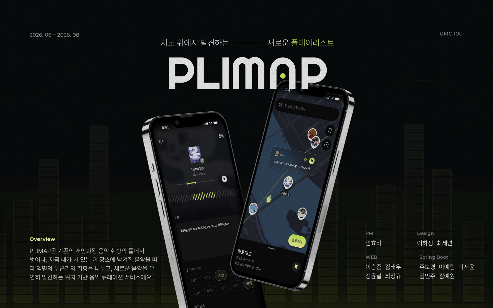
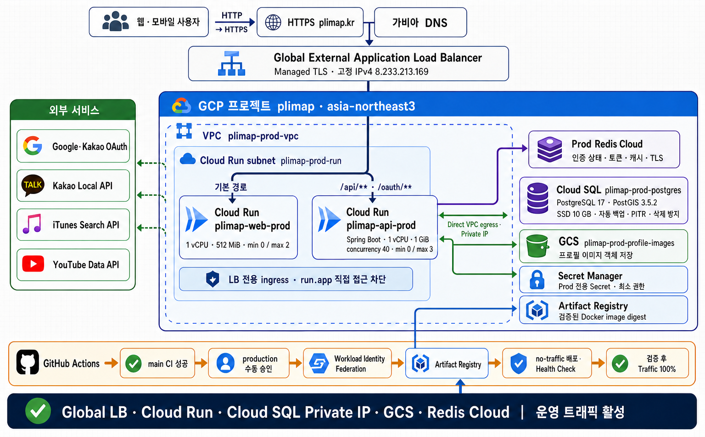
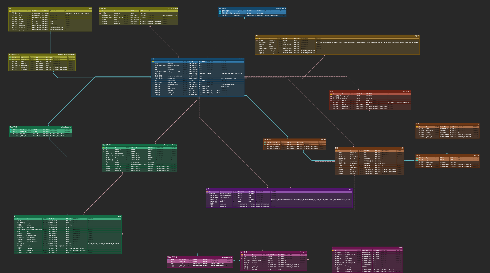

<!-- ============================================================
     PLIMAP BE - GitHub Repository README
     Brand Color: #C8F940
     ============================================================ -->

<h1 style="display: flex; align-items: center; gap: 10px; margin: 0;">
  
  PLIMAP BE
</h1>

<p align="center">
  
</p>

<p align="center">
  음악과 장소를 연결해 지도 위에 기록하고 공유하는 <b>PLIMAP</b>의 백엔드 깃허브입니다.
</p>

<p align="center">
  <a href="https://github.com/UMC10th-PLIMAP/PLIMAP-BE/actions/workflows/ci.yml"></a>
</p>

<p align="center">
  <a href="https://plimap.kr"></a>&nbsp;
  <a href="mailto:plimapteam@gmail.com"></a>&nbsp;
  <a href="https://plimap.hashnode.dev/"></a>&nbsp;
  <a href="https://www.youtube.com/watch?v=r2dkpsZMRDo&amp;t=1494s"></a>
</p>

<br/>

---

## 🟢 About PLIMAP

**PLIMAP**은 음악을 들었던 순간과 장소를 하나의 **PIN**으로 남기고, 지도와 피드에서 다른 사용자와 공유할 수 있는 서비스입니다.

장소 검색부터 음악 탐색·재생 연결, PIN 기록, 소셜 피드와 실시간 알림까지 음악과 공간을 중심으로 한 경험을 제공합니다.

> **UMC 10기** 프로젝트 · 5명의 Backend 팀원 · Package by Feature 기반의 계층형 아키텍처

---

## 🟢 프로젝트 기간

> **2026.06 ~ ing**

---

## 🟢 핵심 기능

1. Google·Kakao OAuth2 로그인과 JWT 기반 인증
2. Kakao Local 기반 장소 검색, 지도 선택, 북마크와 검색 기록 관리
3. iTunes 음악 검색과 YouTube 영상 매칭·재생 준비
4. 장소와 음악을 연결한 PIN 생성, 수정, 삭제와 지도 조회
5. PIN·장소 음악 좋아요, 사용자 팔로우와 개인화 피드
6. 도메인 이벤트와 SSE를 활용한 실시간 알림
7. 회원·PIN 신고, 1:1 문의와 관리자 제재 기능

---

## 🟢 Team

<table>
  <tr>
    <td align="center" width="20%"><a href="https://github.com/joobogyeong"></a><br/><b>주보경</b><br/><a href="https://github.com/joobogyeong"></a></td>
    <td align="center" width="20%"><a href="https://github.com/yerimi00"></a><br/><b>이예림</b><br/><a href="https://github.com/yerimi00"></a></td>
    <td align="center" width="20%"><a href="https://github.com/deli-minju"></a><br/><b>김민주</b><br/><a href="https://github.com/deli-minju"></a></td>
    <td align="center" width="20%"><a href="https://github.com/seoyoon127"></a><br/><b>이서윤</b><br/><a href="https://github.com/seoyoon127"></a></td>
    <td align="center" width="20%"><a href="https://github.com/ywkim1m"></a><br/><b>김예원</b><br/><a href="https://github.com/ywkim1m"></a></td>
  </tr>
</table>

### Backend 역할 분담

| 이름 | 담당 영역                         |
| --- |-------------------------------|
| 주보경 | 인프라 및 클라우드                    |
| 이예림 | Member·Auth 도메인, Admin API 설계 |
| 김민주 | Place 도메인                     |
| 이서윤 | Pin 도메인                       |
| 김예원 | Track 도메인                     |

---

## 🟢 Tech Stack

<table>
  <tr>
    <th width="180">Category</th>
    <th>Stack</th>
  </tr>
  <tr>
    <td><b>Backend</b></td>
    <td>
      
      
      
      
      
      
    </td>
  </tr>
  <tr>
    <td><b>Database / Cache</b></td>
    <td>
      
      
      
      
    </td>
  </tr>
  <tr>
    <td><b>Infra / DevOps</b></td>
    <td>
      
      
      
      
      
      
      
    </td>
  </tr>
  <tr>
    <td><b>External Services</b></td>
    <td>
      
      
      
      
      
    </td>
  </tr>
  <tr>
    <td><b>API Docs / Test</b></td>
    <td>
      
      
      
    </td>
  </tr>
</table>

---

## 🟢 System Architecture

<p align="center">
  
</p>

PLIMAP은 **Package by Feature + Layered Architecture**를 사용합니다. 각 도메인 내부는 `Controller → Service → Repository → Entity` 방향으로 의존하며, Service 계층의 상태 변경과 조회 책임을 `command`와 `query`로 분리한 **부분적 CQRS**를 적용합니다.

자세한 설계는 [아키텍처 문서](docs/ARCHITECTURE.md)를 참고합니다.

---

## 🟢 프로젝트 구조

```text
src/main/java/com/example/plimap
├── domain
│   ├── admin           # 관리자 조회·제재
│   ├── auth            # OAuth2·JWT·약관
│   ├── home            # 홈 화면 복합 조회
│   ├── inquiry         # 1:1 문의
│   ├── member          # 회원·프로필·팔로우
│   ├── notification    # 알림 저장·SSE 구독
│   ├── pin             # PIN·피드·지도 조회
│   ├── place           # 장소·검색·북마크
│   ├── report          # 회원·PIN 신고
│   └── track           # 음악·장소 음악·재생 연결
└── global
    ├── apiPayload      # 공통 응답·예외 처리
    ├── config          # 애플리케이션 설정
    ├── entity          # 공통 엔티티
    ├── external        # 외부 API·스토리지 연동
    ├── logging         # 공통 HTTP 오류 로그
    ├── security        # 인증·인가
    └── swagger         # OpenAPI 설정
```

---

## 🟢 ERD

PLIMAP은 PostgreSQL/PostGIS를 사용하며, 스키마 변경은 Flyway Migration으로 관리합니다.

- 전체 관계도, 테이블 정의와 DDL: [docs/ERD.md](docs/ERD.md)
- Migration·QueryDSL·Testcontainers 가이드: [docs/DATABASE.md](docs/DATABASE.md)

<p align="center">
  
</p>

---

## 🟢 배포 환경

| Environment | Branch | Public Entry | Runtime / Data |
| --- | --- | --- | --- |
| Local | - | `http://localhost:8080` | Spring Boot + Docker Compose PostGIS·Redis |
| Dev | `develop` | `https://dev.plimap.kr` | Cloud Run + Supabase PostgreSQL/PostGIS + Redis Cloud |
| Prod | `main` | `https://plimap.kr` | Global Load Balancer + Cloud Run + Cloud SQL PostgreSQL/PostGIS + Redis Cloud |

- Dev는 `dev.plimap.kr`의 Traefik이 API·OAuth·Swagger 경로를 Cloud Run으로 전달합니다.
- Prod는 Global External Application Load Balancer가 `/api/**`, `/oauth/**`를 API Cloud Run으로 전달합니다.
- Prod Swagger/OpenAPI와 Actuator 공개 경로는 비활성화되어 있습니다.

상세한 환경 구성과 배포 검증 절차는 [배포 문서](docs/DEPLOYMENT.md)를 참고합니다.

---

## 🟢 Documentation

| 문서 | 설명 |
| --- | --- |
| [ARCHITECTURE.md](docs/ARCHITECTURE.md) | 아키텍처, 패키지 구조와 데이터베이스 설계 원칙 |
| [ERD.md](docs/ERD.md) | ERD, 테이블 관계와 PostgreSQL DDL |
| [DEPLOYMENT.md](docs/DEPLOYMENT.md) | Local·Dev·Prod 구성과 배포 절차 |
| [DATABASE.md](docs/DATABASE.md) | Flyway, PostGIS, QueryDSL과 테스트 규칙 |
| [CONVENTION.md](docs/CONVENTION.md) | Issue, 브랜치, 커밋과 Pull Request 규칙 |
| [CODE_STYLE.md](docs/CODE_STYLE.md) | Java·Spring Boot 코드 스타일 |

---

## 🟢 실행 방법

### Prerequisites

- Java 21
- Docker Desktop 또는 Docker Engine + Docker Compose

### Local Run

1. 필요한 경우 환경 변수 예시 파일을 복사합니다. 기본값을 그대로 사용하면 생략할 수 있습니다.

   ```bash
   # macOS/Linux
   cp .env.example .env

   # Windows PowerShell
   Copy-Item .env.example .env
   ```

2. 로컬 PostGIS와 Redis를 실행합니다.

   ```bash
   docker compose up -d
   ```

3. `local` 프로필로 애플리케이션을 실행합니다.

   ```bash
   # macOS/Linux
   ./gradlew bootRun --args='--spring.profiles.active=local'

   # Windows PowerShell
   .\gradlew.bat bootRun --args="--spring.profiles.active=local"
   ```

4. Swagger UI를 확인합니다.

   ```text
   http://localhost:8080/swagger-ui/index.html
   ```

### Test & Build

```bash
# macOS/Linux
./gradlew test
./gradlew clean build

# Windows PowerShell
.\gradlew.bat test
.\gradlew.bat clean build
```

통합 테스트는 PostGIS와 Redis Testcontainers를 사용하므로 Docker가 실행 중이어야 합니다.

### Stop Local Containers

```bash
docker compose down
```

> `docker compose down -v`는 로컬 데이터 볼륨을 삭제하므로 초기화가 필요한 경우에만 실행합니다.

---

<p align="center">
  
</p>

<p align="center">
  <sub>UMC 10th · PLIMAP · 2026</sub>
</p>
